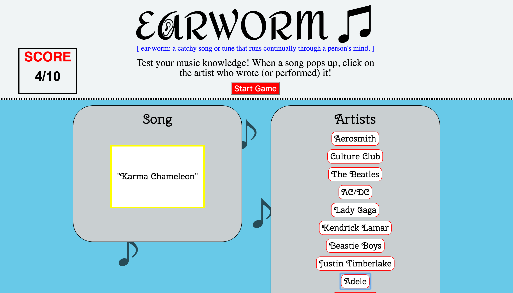

# Celebrity-Match-Game / EARWORM

## Earworm: a catchy song or tune that runs continually through a person's mind.

#### A game that mixes music and trivia - match the song/title to the artist/band who wrote it.

Static list of artists/bands on the right side of the page.  When user hits 'Start Game,' a song written or performed by one of the artists/bands will be randomly generated and the title will appear in the "Song" div and the song will begin to play automatically.  The user then clicks on the artist they believe wrote it and immediately a new song title will populate/play upon guessing and they continue to play until all songs have been guessed.  If they get the answer correct, the background of "Song" box will flash green and a score will be added to the Score Box.  If the user answers incorrectly,the background of the "Song" div will flash red and no points are added.

Still working on:  cross browser compatibility, resetting game to initial start, limiting start button click to once, style formatting differences between Mac/PC, some additional styling.

Tech used:
* HTML5
* CSS
* Javascript (some JQuery)

[Your turn to play the game!](https://kerby51.github.io/Celebrity-Match-Game/)
